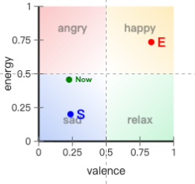
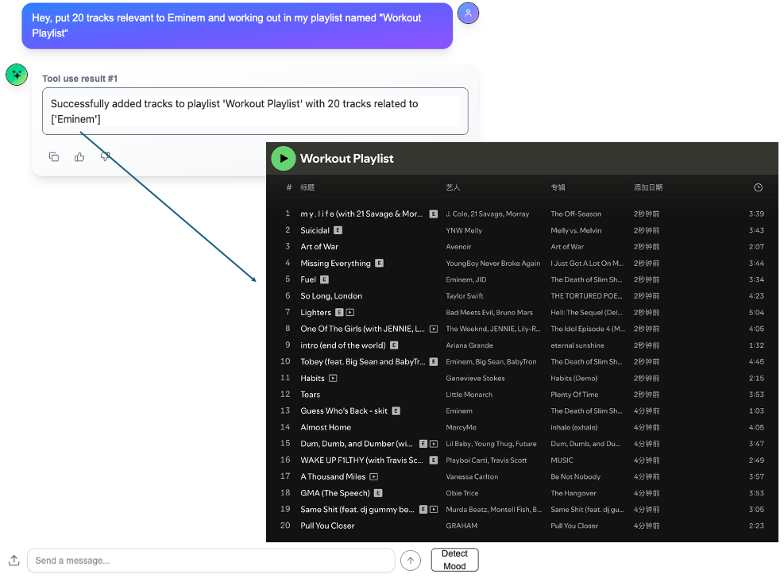

# 🎶PersonalAIs: Generative AI Agent for Personalized Music Recommendations🤖


> 🌟 **Discover Your Next Favorite Song with AI-Powered Recommendations** 🌟

PersonalAIs is an intelligent music recommendation assistant, integrating Spotify API and AI conversation systems. Users can interact with AI through natural language to receive personalized music recommendations and playback control services.

This project was implemented during **Google Summer of Code 2025**

- **PersonalAls**: Generative Al Agent for Personalized Music Recommendations
- Organisation: **GFOSS**
- Mentors: **[Thanos Aidinis](https://github.com/ThanAid)** & **[Giannis Prokopiou](https://github.com/GiannisProkopiou)**
- Applicant: **[Ke Ye](https://github.com/cocoshe)**

<br/>

AI-powered agents are becoming increasingly popular across industries, from customer support to personal assistants. As these agents grow in complexity, efficiently managing their context, tools, and workflows is critical.

The Model Context Protocol (MCP) provides a solution for this challenge. By enabling modular and decoupled agent development, MCP standardizes how agents handle context, interact with external tools, and maintain flexible workflows. This makes it easier to build, extend, and maintain sophisticated AI assistants. You can go to the [doc](https://modelcontextprotocol.io/docs/sdk) to know about the MCP.

Spotify’s Developer Platform provides a wide range of APIs for developers. These APIs expose core Spotify functionality to developers, more information can be found [here](https://developer.spotify.com/documentation/web-api)

Building on this foundation, PersonalAIs combines MCP, LLM, and Spotify integration to create a conversational music assistant that delivers real-time, mood-aware recommendations, going beyond traditional music suggestions based solely on historical listening data.

👉 The GitHub repository can be found here: [PersonalAIs](https://github.com/eellak/gsoc2025-PersonalAIs)

## ⚙️Why use MCP?


Without an MCP, you need to write many function calls on the client side, and each call requires manually constructing the parameter list and other details according to each API’s specific format. As the number of APIs grows, this quickly becomes complex.

While with an MCP, however, you no longer need to write new code for every API on the client side. By converting APIs into the MCP format, you can directly feed them to the LLM’s function calls. This approach enables a clean decoupling between your APIs and the client logic.

## 🧠Why use LLM?

Large Language Models (LLMs) are essential for enabling intelligent, context-aware conversations in PersonalAIs. They provide two major capabilities:

1. **Translating Chat into Mood Signals**: LLMs can interpret user messages and quantify the underlying mood into measurable values, such as valence (positivity) and energy (intensity). These metrics are then used to match songs that align with the user’s current emotional state, enabling real-time, mood-aware music recommendations.
2. **Converting Text to Actions**: LLMs can analyze user messages and determine what kind of song recommendations the user wants. For example, when a user says “Can you add some rock music to my driving playlist?”, the LLM translates this instruction into an internal action that queries Spotify for suitable tracks. This enables seamless text-to-recommendation interaction, turning natural language requests into actionable music suggestions.

## 🛠️ Tech Stack

- AI Models: Qwen2.5-7B-Instruct for intelligent conversation
- Next.js — Frontend chatbot interface
- MCP  — Frontend MCP client integration, and MCP services. 
- Spotify Web API & Last.fm API — Personal music data, playback control, tracks recall.
- Docker & Docker Compose — Containerized deployment

## 🚀Setting Up the Project

[Here](https://github.com/eellak/gsoc2025-PersonalAIs/blob/main/README.md#%EF%B8%8F-getting-started) is the doc to get start, Docker Deployment is recommended.

<br/>

## 🌟Spotlights

### 🔗MCP Integration

#### MCP Client

The MCP client can be build like this:

```tsx
const stdioTransport = new StdioClientTransport({
  command: s.command,
  args: [...s.args],
  env: {
    ...process.env,
    ...(s.env || {}),
  },
});
client = await experimental_createMCPClient({
  transport: stdioTransport,
});
const toolSetOne = await client.tools();
const tools = {
  ...toolSetOne,
};
clientTools = {
  ...clientTools,
  ...tools,
}
```

The `command`, `args` can be set in a yaml like this:

```yaml
mcpServers:
  spotify-mcp-server:
    type: stdio
    command: python
    args:
      - spotify_mcp_server/main.py
```

<br/>

#### MCP Server

```python
class SpotifyMCPSuperServerV2(SpotifyMCPServer):
    """Super MCP Server with recommendation tools"""
    def __init__(self, spotify_client: SpotifyClient, lastfm_client: LastfmClient, llm_client: LLMClient):
        """
        Initialize MCP server
        """
        self.mcp = FastMCP("spotify-mcp-server")
        self.setup_tools()

    def setup_tools(self):
        """Setup MCP tools"""
        @self.mcp.tool()
        async def recommend_tracks_automatic(activity: str, limit: int = 20, genres: List[str] = [], specific_wanted_artists_in_prompt: List[str] = [], add_to_playlist_or_create: bool = False, playlist_name: Optional[str] = None) -> Dict[str, Any]:
            """
            IMPORTANT: This tool is ONLY triggered when the user EXPLICITLY requests music/song recommendations, or ask for making a playlist for recommendation.
            
            DO NOT trigger this tool for:
            - General mood expression (use mood_detection instead)
            - Emotional state updates
            - Playlist management requests
            - Any other non-recommendation requests
            
            ONLY trigger when user says things like:
            - "Recommend me some songs for..."
            - "I want music for..."
            - "Suggest tracks for..."
            - "Give me music recommendations for..."
            - "Find songs for..."
            - "I need music for..."
            
            This tool creates personalized music recommendations based on activity context and emotional coordinates, then automatically creates or updates playlists.
            
            Args:
                activity (str): The specific activity or context for music recommendation
                    Examples: "working out", "relaxing", "driving", "studying", "running", "meditation"
                limit (int): Maximum number of tracks to recommend (default: 20)
                genres (List[str]): Preferred music genres (e.g., ["pop", "rock", "hip hop", "jazz"])
                specific_wanted_artists_in_prompt (List[str]): Specific artists to include in recommendations
                    Note: Only use when user explicitly mentions specific artists in their request
                add_to_playlist_or_create (bool): Playlist management strategy
                    - False: Create new playlist with activity name
                    - True: Add to existing playlist (playlist_name required)
                playlist_name (str): Name of existing playlist to add tracks to.
                    Required when interacting with playlists (must not be None).
                    Specifically required when add_to_playlist_or_create is True
            
            Returns:
                str: Success message with playlist details and track count
            
            How it works:
            1. Maps activity to emotional coordinates (valence/energy) using LLM
            2. Recalls tracks from user's music library and similar artists
            3. Filters tracks based on emotional coordinates and preferences
            4. Creates new playlist or adds to existing one
            5. Returns confirmation message with playlist details
            
            Note: This tool automatically uses emotional coordinates from point_meta.json if available, 
            or generates appropriate defaults based on the activity type.
            """
```

Here is an example of recommendation tool. You can write description in `@self.mcp.tool()`, or just write docstring under the function tool.

- Option 1:
  ```python
  @self.mcp.tool()
  async def recommend_tracks_automatic(activity: str, limit: int = 20, ...) -> Dict[str, Any]:
      """
      This function generates personalized music recommendations based on user activity
      and mood, optionally adding tracks to a playlist.
      """
      ...
  ```
- Option 2:
  ```python
  @self.mcp.tool(description="Generate mood-based music recommendations for the user")
  async def recommend_tracks_automatic(...):
      ...
  ```

This provides the agent with context about when and how to call a tool, which matters a lot when you want to trigger the tool at the appropriate time.

<br/>

### 🎭Chat-Mood Translation

A key feature of PersonalAIs is its ability to translate natural language chat into emotional signals. By using LLMs, the system can detect a user’s mood during conversation and quantify it into valence and energy, which are then mapped onto an emotion map. This allows music recommendations to be emotion-aware and contextually relevant.

```python
@self.mcp.tool()
async def mood_detection(user_mood_expression: str) -> dict:
    """
    Detect user's mood from natural language expression and generate valence/energy coordinates for emotional state tracking.
    """
```

This tool is called only when the user explicitly wants to express or update their mood, including:

1. Current emotional state – e.g., “I feel sad”, “I’m hyped”, “in a chill mood”
2. Emotional transitions or journeys – e.g., “Help me go from stressed to relaxed”, “I want to transition from sad to happy”

<br/>

### 🎶Mood-based Recommendation and Mood Transitions

#### Mood-Related Features

We maintain an **emotion map**, where users can manually set the start point and end point, fill out a questionnaire to configure it, or set it directly via chat, for example: “I’m sad now, and I wanna be happy.” The map will be like this:(The green point indicate the valence and energy of the track you are playing now)



- Option 1: Click the button to set the start point and end point


- Option 2: Fill the questionnaire


- Option 3: Talk with chatbot


During the recommendation process, we first perform multi-path recall based on the user’s Spotify related information and third-party APIs:


Using the previously introduced MCP server, the system first leverages the LLM to infer the type of tracks the user wants or the appropriate context/activity, such as “for study” or “for workout.” During the recall process, these instructions are translated by the LLM into valence and energy ranges for filtering candidate tracks.

Finally they are ranked according to the user’s current emotional state. The ranking is based on the projection length of each track onto the line connecting the start point and end point on the emotion map. Tracks with projections closer to the start point are played first, ensuring that as the playback queue progresses, the emotional trajectory of the music smoothly transitions from the start point to the end point.


#### 🎤Artists-Specific Recommendation Support

<br/>



PersonalAIs also supports artist-focused recommendations. If a user has a favorite artist, they can specify the artist to receive personalized track suggestions. For example, if the user requests “Eminem”, the system will generate a playlist containing tracks from related artists as well as the specified artist, expanding the discovery space while keeping the recommendations aligned with the user’s taste.

<br/>

#### 📀Smart Playlist Updates: Auto-Add or Manual Selection Support


PersonalAIs provides flexible playlist management, allowing users to either automatically add tracks or manually select tracks.

With the auto-add pipeline, the agent can handle the entire recommendation flow: it considers your current mood, identifies tracks you want, and then automatically adds them to an existing playlist or creates a new playlist if the user wants. 

Alternatively, if the user prefers to manually choose songs, they can tell the chatbot with words such as “select by myself”. In this mode, the agent presents all recommended tracks, allowing the user to click “Add” to include a track or just skip it.

<br/>

## 🏁Conclusion

PersonalAIs combines LLMs, MCP, and Spotify integration to provide **mood-aware, personalized music recommendations**. By mapping user emotions to an emotion map and supporting both automatic and manual playlist management, the system ensures **smooth emotional transitions** and **context-aware music discovery**. It showcases how AI agents can create **more adaptive and engaging listening experiences**.

<br/>

## 📚Sources

- https://modelcontextprotocol.io/docs/sdk
- https://developer.spotify.com/documentation/web-api
- https://github.com/eellak/gsoc2025-PersonalAIs
- https://github.com/eellak/gsoc2025-PersonalAIs/blob/main/README.md#%EF%B8%8F-getting-started
